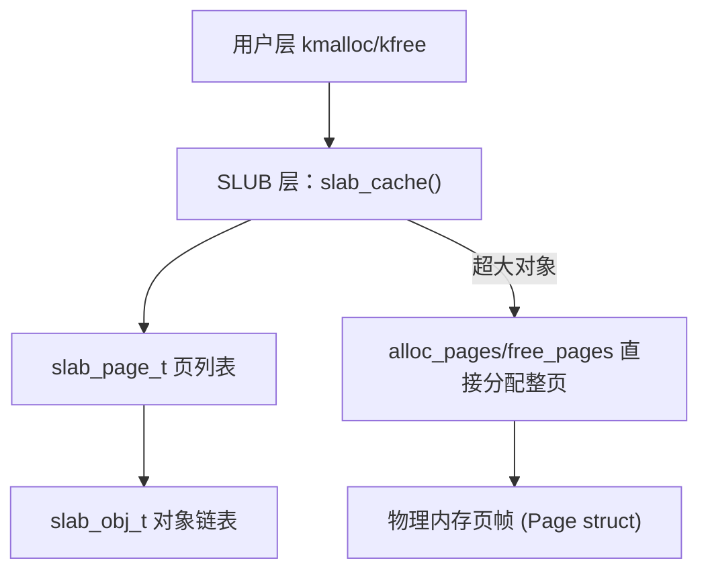
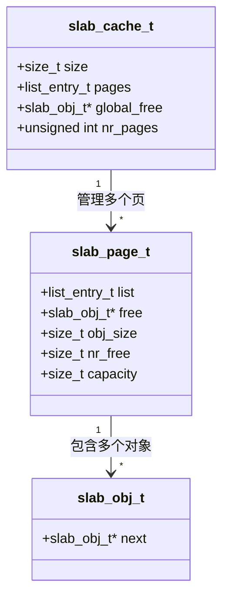
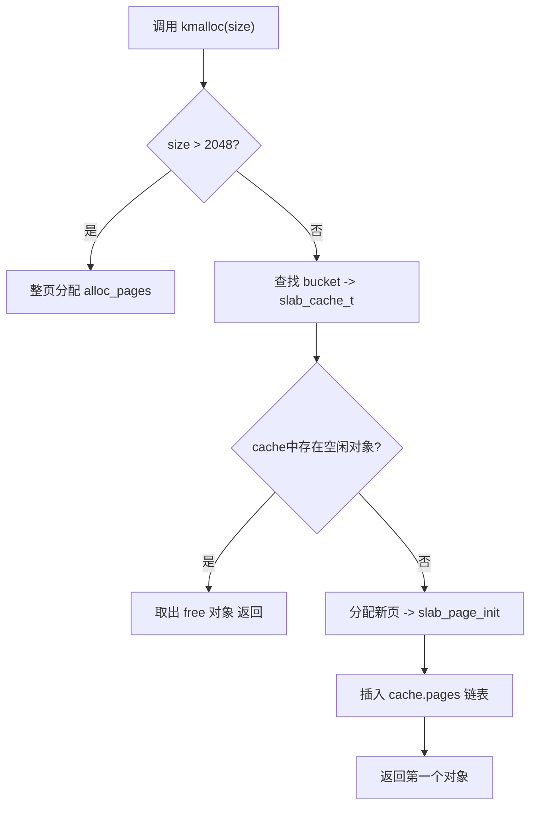
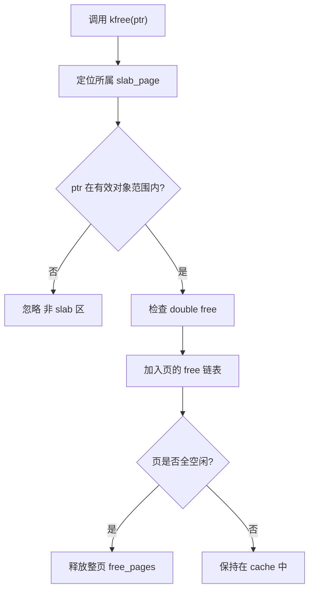
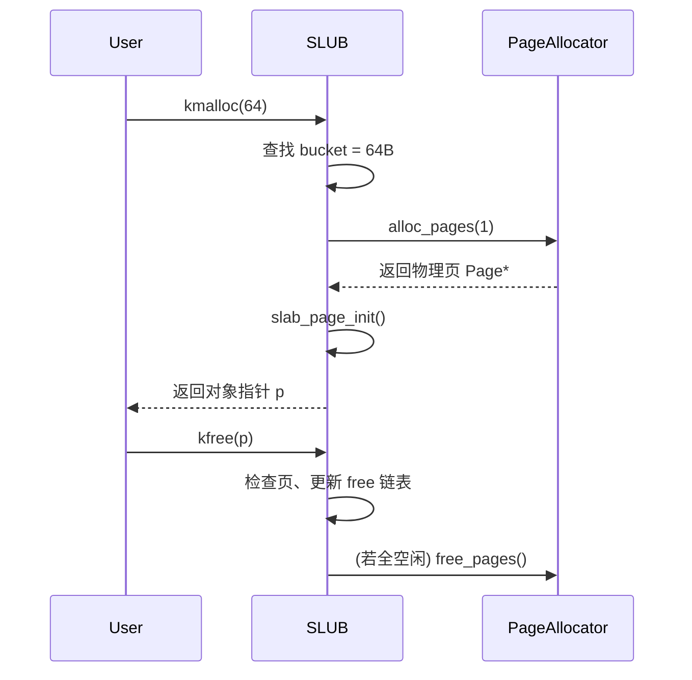

## 一、总体架构

### 体系结构图



说明：

* 用户通过 `kmalloc` 请求内存；
* SLUB 层根据大小选择对应 `slab_cache`；
* 若页内有空闲对象，从 `slab_page_t.free` 链取出；
* 若无空闲页，向底层 `alloc_pages()` 申请新页；
* `kfree` 则反向释放并可能回收整页。

---

## 二、数据结构关系图



该图展示：

* `slab_cache_t` 管理一个对象大小的所有页；
* 每个 `slab_page_t` 管理一页内的多个 `slab_obj_t`；
* 空闲对象通过单链表链接。

---

## 三、核心函数流程

### kmalloc 流程图



---

### kfree 流程图



---

## 四、内存布局示意

以 64 字节对象为例（`PAGE_SIZE = 4096`）：

```
+-------------------------------------------------------+
| slab_page_t header (~64B)                             |
+-------------------------------------------------------+
| obj[0]: slab_obj_t + 用户数据 (64B)                   |
| obj[1]: slab_obj_t + 用户数据 (64B)                   |
| obj[2]: slab_obj_t + 用户数据 (64B)                   |
| ...                                                   |
| obj[n]: slab_obj_t + 用户数据 (64B)                   |
+-------------------------------------------------------+
| (空闲对象通过 o->next 链接成单链表)                  |
+-------------------------------------------------------+
```

---

## 五、运行状态图（逻辑时序）



---

## 六、调试输出示例

```text
[Buddy] Alloc 1 pages (order 0) @ 0x87fff000
slub 分配 size=8 -> 0xffffffffc7fffff8
[Buddy] Split block: order 3 -> two order 2
[Buddy] Split block: order 2 -> two order 1
[Buddy] Split block: order 1 -> two order 0
[Buddy] Alloc 1 pages (order 0) @ 0x87ff7000
slub 分配 size=24 -> 0xffffffffc7ff7fd0
[Buddy] Alloc 1 pages (order 0) @ 0x87ff8000
slub 分配 size=40 -> 0xffffffffc7ff8fb0
slub 分配 size=56 -> 0xffffffffc7ff8f70
```
SLUB 需要分配一个 8B 对象（kmalloc(8)）。

当前 free_area 中没有合适的 order=0 块（1页），buddy 找到一个更大阶的空闲块并经过 split后分配了一个 order=0 块，返回 page 指针，buddy_alloc_pages 打印这行。

SLUB 在得到页后，把页映射成内核虚拟地址 pagev = page2pa(p) + va_pa_offset，然后 slab_page_init() 构造对象链，取出一个对象返回；打印 slub 分配 size=8 -> \<virtual>。

在 buddy_init_memmap() 时，free map 是按最大可连块分割放入 free lists（你是从 order = MAX_ORDER-1 往下找最大能放下 n 的 order，然后 list_add）。因此在早期，大多数空闲块可能存在于较高阶（例如 order=9/8/7 等）。

当 buddy_alloc_pages(1) 请求 1 页（order 0）时，若 free_list[0] 为空，buddy_alloc_pages 会向上查找第一个非空阶 cur（这里可能是 3 或更高），取出一个大块，然后逐级分裂（while cur > order），每次分裂都会创建一个右侧 buddy 并插回对应阶的 free_list。